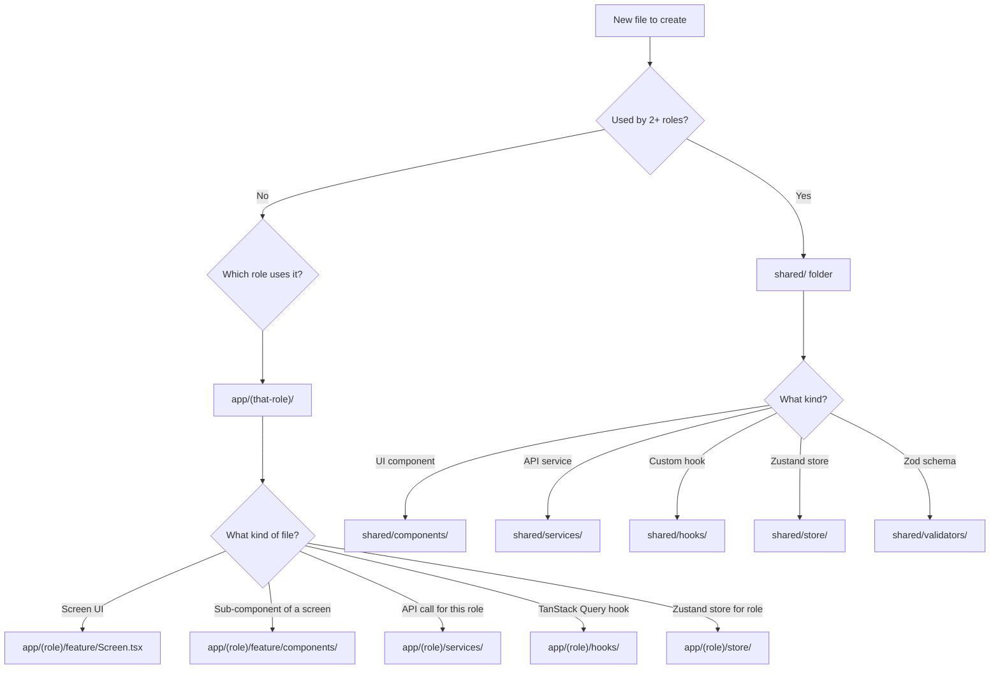

# 🏗️ Project Architecture — Multi-Role React Native App

> **React Native 0.84+ · React 19 · Zustand · TanStack Query · React Navigation v7**

---

## Design Philosophy

| Principle | What It Means |
|---|---|
| **Co-location** | Components, hooks, services, and stores live **next to the screens** that use them |
| **Shared vs. Feature** | If 2+ roles use it → goes in `shared/`. If only 1 role uses it → stays inside that role's folder |
| **Flat within features** | Each screen folder is self-contained: its component, its sub-components, its hooks |
| **Barrel exports** | Every folder has an `index.ts` for clean imports |

---

## 📁 Complete Folder Structure

```
src/
│
├── App.tsx                                # Root: Providers + ErrorBoundary + Router
│
├── app/                                   # ══════ ALL SCREENS BY ROLE ══════
│   │
│   ├── (public)/                          # ── Unauthenticated ──
│   │   ├── login/
│   │   │   ├── Login.tsx                  # Screen component
│   │   │   ├── components/               # Components ONLY used by Login
│   │   │   │   ├── LoginForm.tsx
│   │   │   │   └── SocialLoginButtons.tsx
│   │   │   └── hooks/
│   │   │       └── useLoginForm.ts        # Form state + validation
│   │   ├── forgot-password/
│   │   │   └── ForgotPassword.tsx
│   │   └── index.ts
│   │
│   ├── (merchandiser)/                    # ── Merchandiser Role ──
│   │   ├── home/
│   │   │   ├── MerchHome.tsx
│   │   │   └── components/
│   │   │       ├── DashboardStats.tsx
│   │   │       ├── RecentOrders.tsx
│   │   │       └── QuickActions.tsx
│   │   ├── orders/
│   │   │   ├── MerchOrders.tsx
│   │   │   ├── MerchOrderDetail.tsx
│   │   │   └── components/
│   │   │       ├── OrderCard.tsx
│   │   │       ├── OrderFilters.tsx
│   │   │       └── OrderStatusBadge.tsx
│   │   ├── products/
│   │   │   ├── MerchProducts.tsx
│   │   │   ├── MerchProductDetail.tsx
│   │   │   └── components/
│   │   │       ├── ProductCard.tsx
│   │   │       └── ProductGrid.tsx
│   │   ├── profile/
│   │   │   └── MerchProfile.tsx
│   │   │
│   │   │── services/                      # API calls ONLY for Merchandiser
│   │   │   ├── merchOrderService.ts
│   │   │   └── merchProductService.ts
│   │   ├── hooks/                         # TanStack Query hooks for this role
│   │   │   ├── useMerchOrders.ts
│   │   │   └── useMerchProducts.ts
│   │   ├── store/                         # Zustand stores scoped to this role
│   │   │   └── useMerchStore.ts
│   │   └── index.ts
│   │
│   ├── (exhibition)/                      # ── Exhibition Role ──
│   │   ├── home/
│   │   │   ├── ExHome.tsx
│   │   │   └── components/
│   │   │       ├── ExDashboard.tsx
│   │   │       └── UpcomingEvents.tsx
│   │   ├── catalog/
│   │   │   ├── ExCatalog.tsx
│   │   │   └── components/
│   │   │       ├── CatalogCard.tsx
│   │   │       └── CatalogFilters.tsx
│   │   ├── bookings/
│   │   │   ├── ExBookings.tsx
│   │   │   └── components/
│   │   │       └── BookingCard.tsx
│   │   ├── profile/
│   │   │   └── ExProfile.tsx
│   │   │
│   │   ├── services/
│   │   │   ├── exCatalogService.ts
│   │   │   └── exBookingService.ts
│   │   ├── hooks/
│   │   │   ├── useExCatalog.ts
│   │   │   └── useExBookings.ts
│   │   ├── store/
│   │   │   └── useExStore.ts
│   │   └── index.ts
│   │
│   ├── (sales)/                           # ── Sales Role ──
│   │   ├── home/
│   │   │   ├── SalesHome.tsx
│   │   │   └── components/
│   │   │       ├── SalesDashboard.tsx
│   │   │       └── TargetProgress.tsx
│   │   ├── leads/
│   │   │   ├── SalesLeads.tsx
│   │   │   └── components/
│   │   │       ├── LeadCard.tsx
│   │   │       └── LeadPipeline.tsx
│   │   ├── invoices/
│   │   │   ├── SalesInvoices.tsx
│   │   │   └── components/
│   │   │       ├── InvoiceCard.tsx
│   │   │       └── InvoiceFilters.tsx
│   │   ├── profile/
│   │   │   └── SalesProfile.tsx
│   │   │
│   │   ├── services/
│   │   │   ├── salesLeadService.ts
│   │   │   └── salesInvoiceService.ts
│   │   ├── hooks/
│   │   │   ├── useSalesLeads.ts
│   │   │   └── useSalesInvoices.ts
│   │   ├── store/
│   │   │   └── useSalesStore.ts
│   │   └── index.ts
│   │
│   └── (customer)/                        # ── Customer Role ──
│       ├── home/
│       │   ├── CusHome.tsx
│       │   └── components/
│       │       ├── CusDashboard.tsx
│       │       └── FeaturedProducts.tsx
│       ├── orders/
│       │   ├── CusOrders.tsx
│       │   ├── CusOrderDetail.tsx
│       │   └── components/
│       │       ├── CusOrderCard.tsx
│       │       └── CusOrderTimeline.tsx
│       ├── invoice/
│       │   ├── CusPayInvoice.tsx
│       │   └── components/
│       │       ├── InvoiceSummary.tsx
│       │       └── PaymentMethodPicker.tsx
│       ├── profile/
│       │   └── CusProfile.tsx
│       │
│       ├── services/
│       │   ├── cusOrderService.ts
│       │   └── cusInvoiceService.ts
│       ├── hooks/
│       │   ├── useCusOrders.ts
│       │   └── useCusInvoices.ts
│       ├── store/
│       │   └── useCusStore.ts
│       └── index.ts
│
├── shared/                                # ══════ SHARED ACROSS ALL ROLES ══════
│   │
│   ├── components/                        # Reusable UI components
│   │   ├── ui/                            # Atomic design primitives
│   │   │   ├── AppButton.tsx
│   │   │   ├── AppText.tsx
│   │   │   ├── AppHeader.tsx
│   │   │   ├── AppInput.tsx
│   │   │   ├── AppModal.tsx
│   │   │   ├── AppLoader.tsx
│   │   │   └── index.ts
│   │   ├── layout/                        # Layout wrappers
│   │   │   ├── ScreenWrapper.tsx          # SafeArea + padding + bg color
│   │   │   ├── KeyboardWrapper.tsx
│   │   │   └── index.ts
│   │   ├── feedback/                      # Toast, empty states, errors
│   │   │   ├── Toast.tsx
│   │   │   ├── EmptyState.tsx
│   │   │   └── index.ts
│   │   ├── Icon.tsx
│   │   ├── ErrorBoundary.tsx
│   │   └── index.ts
│   │
│   ├── services/                          # API calls used by 2+ roles
│   │   ├── authService.ts
│   │   ├── userService.ts
│   │   └── notificationService.ts
│   │
│   ├── hooks/                             # Shared custom hooks
│   │   ├── useAuth.ts                     # Login/logout/token logic
│   │   ├── useRefreshToken.ts
│   │   └── useDebounce.ts
│   │
│   ├── store/                             # Global Zustand stores
│   │   ├── useUserStore.ts                # User + token + role
│   │   ├── useAppStore.ts                 # App-wide UI state (theme, lang)
│   │   └── zustand.storage.ts             # MMKV adapter
│   │
│   ├── validators/                        # Zod schemas
│   │   ├── authValidator.ts               # loginSchema, registerSchema
│   │   ├── userValidator.ts
│   │   └── productValidator.ts
│   │
│   └── utils/                             # Pure utility functions
│       ├── formatDate.ts
│       ├── formatCurrency.ts
│       └── index.ts
│
├── router/                                # ══════ ALL NAVIGATION ══════
│   ├── index.tsx                          # AppRouter (auth guard)
│   ├── AuthStack.tsx                      # Login / ForgotPassword
│   ├── RoleRouter.tsx                     # role → correct tab navigator
│   ├── tabs/
│   │   ├── MerchandiserTabs.tsx
│   │   ├── ExhibitionTabs.tsx
│   │   ├── SalesTabs.tsx
│   │   └── CustomerTabs.tsx
│   └── stacks/                            # Nested stack per tab
│       ├── MerchOrdersStack.tsx
│       ├── CusOrdersStack.tsx
│       └── ...
│
├── lib/                                   # ══════ INFRASTRUCTURE ══════
│   ├── api.ts                             # Axios + interceptors
│   ├── queryClient.ts                     # TanStack Query client config
│   └── constants.ts                       # App-wide constants
│
├── theme/                                 # ══════ DESIGN SYSTEM ══════
│   ├── colors.ts
│   ├── fonts.ts
│   ├── spacing.ts
│   ├── shadows.ts
│   └── index.ts                           # Re-exports everything
│
├── types/                                 # ══════ GLOBAL TYPES ══════
│   ├── auth.type.ts
│   ├── user.type.ts
│   ├── product.type.ts
│   ├── order.type.ts
│   ├── router.type.ts                     # All param lists for all roles
│   └── api.type.ts                        # Generic API response wrappers
│
└── assets/
    ├── icons/
    │   ├── Bell.svg
    │   ├── Heart_01.svg
    │   └── index.ts
    ├── images/                            # PNGs, JPGs
    └── animations/                        # Lottie files
```

---

## 🧠 Decision Rules — Where Does This File Go?



---

## 📂 Example: How a Single Screen Folder Works

Take `(customer)/orders/` as an example:

```
(customer)/orders/
├── CusOrders.tsx              ← Main screen (uses hooks, renders components)
├── CusOrderDetail.tsx         ← Detail screen
└── components/
    ├── CusOrderCard.tsx       ← Card rendered in the list
    └── CusOrderTimeline.tsx   ← Timeline shown in detail
```

```typescript
// CusOrders.tsx — clean, thin screen component
import React from 'react';
import { FlatList } from 'react-native';
import { ScreenWrapper } from '@/shared/components/layout';
import { AppHeader, AppLoader } from '@/shared/components/ui';
import { EmptyState } from '@/shared/components/feedback';
import { CusOrderCard } from './components/CusOrderCard';
import { useCusOrders } from '../hooks/useCusOrders';
import type { CusScreenProps } from '@/types/router.type';

export const CusOrders = ({ navigation }: CusScreenProps<'CusOrders'>) => {
  const { data: orders, isLoading } = useCusOrders();

  if (isLoading) return <AppLoader />;

  return (
    <ScreenWrapper>
      <AppHeader title="My Orders" />
      <FlatList
        data={orders}
        keyExtractor={item => item.id}
        renderItem={({ item }) => (
          <CusOrderCard
            order={item}
            onPress={() => navigation.navigate('CusOrderDetail', { orderId: item.id })}
          />
        )}
        ListEmptyComponent={<EmptyState message="No orders yet" />}
      />
    </ScreenWrapper>
  );
};
```

---

## 📂 Example: Role-Scoped Service + Hook

```typescript
// app/(customer)/services/cusOrderService.ts
import { Api } from '@/lib/api';
import type { Order } from '@/types/order.type';

export const cusOrderService = {
  getOrders: async (): Promise<Order[]> => {
    const res = await Api.get('/customer/orders');
    return res.data;
  },
  getOrderById: async (id: string): Promise<Order> => {
    const res = await Api.get(`/customer/orders/${id}`);
    return res.data;
  },
};
```

```typescript
// app/(customer)/hooks/useCusOrders.ts
import { useQuery } from '@tanstack/react-query';
import { cusOrderService } from '../services/cusOrderService';

export const useCusOrders = () => {
  return useQuery({
    queryKey: ['customer', 'orders'],
    queryFn: cusOrderService.getOrders,
  });
};

export const useCusOrderDetail = (orderId: string) => {
  return useQuery({
    queryKey: ['customer', 'orders', orderId],
    queryFn: () => cusOrderService.getOrderById(orderId),
    enabled: !!orderId,
  });
};
```

---

## 📂 Example: Role-Scoped Zustand Store

```typescript
// app/(customer)/store/useCusStore.ts
import { create } from 'zustand';

type CusStore = {
  selectedTab: 'active' | 'completed' | 'cancelled';
  setSelectedTab: (tab: CusStore['selectedTab']) => void;

  // Cart state (customer-only)
  cartCount: number;
  setCartCount: (count: number) => void;
};

export const useCusStore = create<CusStore>(set => ({
  selectedTab: 'active',
  setSelectedTab: tab => set({ selectedTab: tab }),

  cartCount: 0,
  setCartCount: count => set({ cartCount: count }),
}));
```

---

## 📂 Import Path Examples

```typescript
// From a Customer screen:
import { AppButton } from '@/shared/components/ui';        // Shared UI
import { ScreenWrapper } from '@/shared/components/layout'; // Shared layout
import { useAuth } from '@/shared/hooks/useAuth';           // Shared hook
import useUserStore from '@/shared/store/useUserStore';     // Global store
import { colors } from '@/theme';                           // Theme tokens
import { CusOrderCard } from './components/CusOrderCard';   // Local component
import { useCusOrders } from '../hooks/useCusOrders';       // Role hook
import { useCusStore } from '../store/useCusStore';         // Role store
```

---

## 🔑 Key Naming Conventions

| Item | Convention | Example |
|---|---|---|
| **Screen files** | `PascalCase` with role prefix | `CusOrders.tsx`, `MerchHome.tsx` |
| **Components** | `PascalCase` | `OrderCard.tsx`, `AppButton.tsx` |
| **Hooks** | `camelCase` with `use` prefix | `useCusOrders.ts`, `useAuth.ts` |
| **Services** | `camelCase` with `Service` suffix | `cusOrderService.ts` |
| **Stores** | `camelCase` with `use` + `Store` suffix | `useCusStore.ts` |
| **Types** | `PascalCase` with `.type.ts` extension | `order.type.ts` |
| **Validators** | `camelCase` with `Validator` suffix | `authValidator.ts` |
| **Folders** | `kebab-case` for multi-word | `forgot-password/` |

---

## ⚠️ Common Mistakes to Avoid

| ❌ Don't | ✅ Do |
|---|---|
| Put all components in `shared/components/` | Only shared → `shared/`, role-specific → `app/(role)/` |
| Create one giant service file per domain | Split by role: `cusOrderService`, `merchOrderService` |
| Import role-specific code across roles | If you need it in 2 roles, move it to `shared/` |
| Put hooks inside components | Keep hooks in `hooks/` folder at role or shared level |
| Mix UI state and server state | UI state → Zustand, Server state → TanStack Query |

---

## 📋 Checklist Before Creating Any New File

- [ ] Is this used by more than one role? → `shared/`
- [ ] Is this a screen? → `app/(role)/feature/Screen.tsx`
- [ ] Is this a sub-component of a screen? → `app/(role)/feature/components/`
- [ ] Is this an API call? → `app/(role)/services/` or `shared/services/`
- [ ] Is this a data-fetching hook? → `app/(role)/hooks/` (TanStack Query)
- [ ] Is this UI state? → `app/(role)/store/` or `shared/store/` (Zustand)
- [ ] Is this a pure function? → `shared/utils/`
- [ ] Is this a Zod schema? → `shared/validators/`
